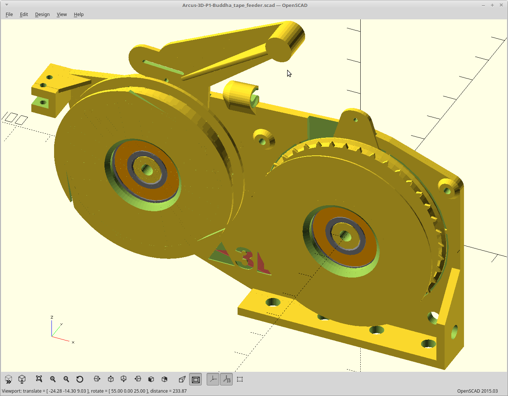
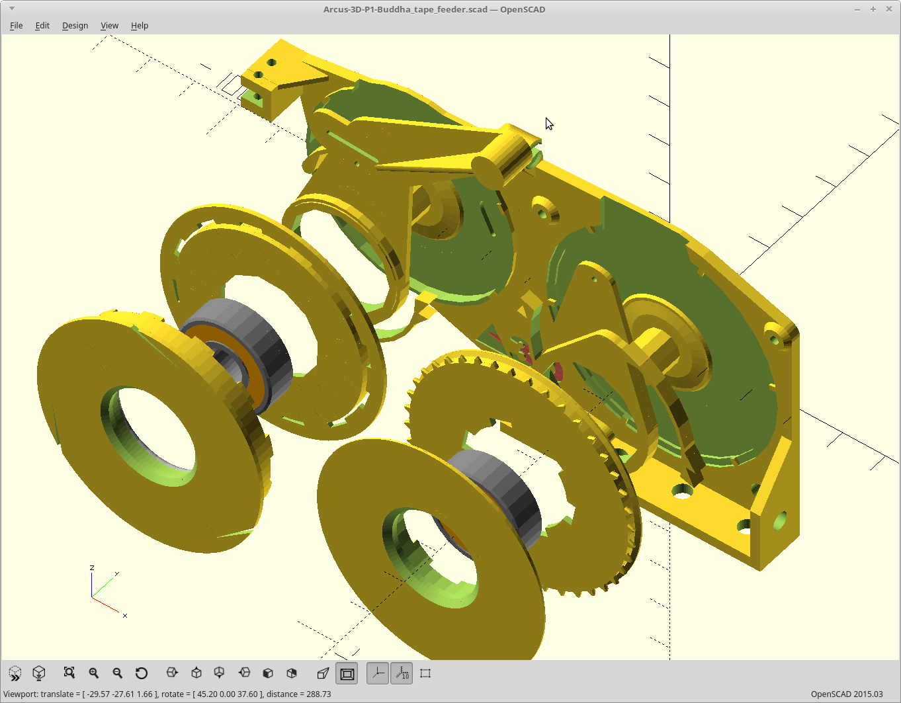

## P1-Buddha-tape-feeder

The [Arcus3D-P1 Buddha tape feeder](https://hackaday.io/project/159792) is open source hardware. This github repository hosts the [OpenSCAD](http://www.openscad.org) source and the rendered STL images for quick access.

Hardware designs (schematics and CAD) files are licensed under the [Creative Commons Attribution-ShareAlike 3.0 Unported License](http://creativecommons.org/licenses/by-sa/3.0/) and follow the terms of the [OSHW (Open-source hardware) Statement of Principles 1.0.](http://freedomdefined.org/OSHW)
